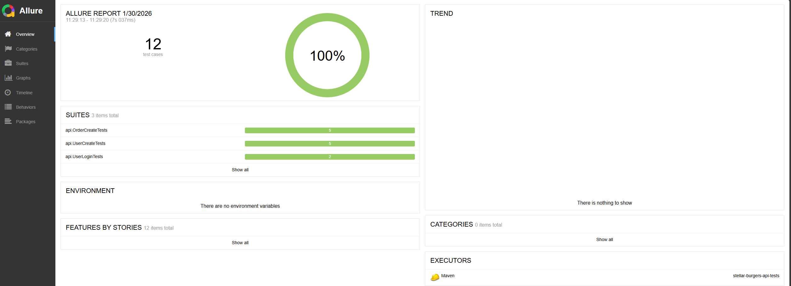

## API Тестирование для "Stellar Burgers"
Проект содержит автоматизированные тесты API для сервиса "Stellar Burgers". 
Тесты охватывают основные эндпоинты системы: создание пользователей, авторизацию и управление заказами.
---

## Цель проекта

Выполнение задания по автоматизации тестирования:
- Протестировать эндпоинты API для Stellar Burgers
- Покрыть основные сценарии работы с пользователями и заказами
- Использовать JUnit 4, REST Assured и Allure для отчетности

---

## 🧪 Структура тестов
### Тестовые классы для API:

1. **`OrderCreateTests.java`** — Тестирование создания заказов:
    - Создание заказа с авторизацией и ингредиентами
    - Создание заказа без авторизации
    - Создание заказа без ингредиентов (пустой массив и null)
    - Создание заказа с неверным хешем ингредиентов

2. **`UserCreateTests.java`** — Тестирование регистрации пользователей:
    - Создание уникального пользователя
    - Попытка создания уже существующего пользователя
    - Создание пользователя без обязательных полей (email, password, name)

3. **`UserLoginTests.java`** —  Тестирование авторизации:
    - Вход под существующим пользователем
    - Вход с неверными учетными данными

---
## 🧪 Запуск тестов
# Все тесты
mvn clean test
# Конкретный тестовый класс
mvn test -Dtest=OrderCreateTests
mvn test -Dtest=UserCreateTests
mvn test -Dtest=UserLoginTests
# С детальным выводом
mvn test -Dtest=OrderCreateTests -DfailIfNoTests=false

## 📊 Отчеты
# Генерация Allure отчета
mvn allure:serve
# Запуск тестов с генерацией Allure результатов
mvn clean test allure:report

---

## 📊 Результаты покрытия кода

### ✅ Полное покрытие требований задания: 12 тестов
- Создание пользователя: 5 тестов
- Логин пользователя: 2 теста
- Создание заказа: 5 тестов

---
## 👤 Автор
### Tokoro77
### 📁 github.com/Tokoro77/Diplom_2
### 🌿 Ветка: develop2